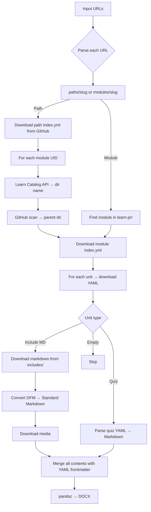

# MsftLearnToDocx

[](https://hub.docker.com/r/ricibald/msft-learn-to-docx)
[](https://hub.docker.com/r/ricibald/msft-learn-to-docx)
[](LICENSE)
[](#prerequisites)
[](#)

.NET 8 console app that converts Microsoft Learn training paths and modules into a unified Markdown document and a Word (DOCX) file via **pandoc**.

> **Find learning paths**: browse all available Microsoft Learn paths at  
> <https://learn.microsoft.com/en-us/training/browse/?resource_type=learning%20path>

---

## Quick Start — Docker Hub

No local install required. Pull the pre-built image and run in one command:

```bash
docker run --rm \
  -v "$(pwd)/output:/output" \
  -v msftlearn-cache:/cache \
  -e GITHUB_TOKEN="$GITHUB_TOKEN" \
  ricibald/msft-learn-to-docx \
  "https://learn.microsoft.com/en-us/training/paths/copilot/"
```

Multiple URLs merged into a single document:

```bash
docker run --rm \
  -v "$(pwd)/output:/output" \
  -v msftlearn-cache:/cache \
  -e GITHUB_TOKEN="$GITHUB_TOKEN" \
  ricibald/msft-learn-to-docx \
  "https://learn.microsoft.com/en-us/training/paths/copilot/" \
  "https://learn.microsoft.com/en-us/training/paths/gh-copilot-2/" \
  --title "GitHub Copilot Complete Guide"
```

In PowerShell Core:

```powershell
docker run --rm `
  -v "${PWD}/output:/output" `
  -v msftlearn-cache:/cache `
  -e GITHUB_TOKEN="$env:GITHUB_TOKEN" `
  ricibald/msft-learn-to-docx `
  "https://learn.microsoft.com/en-us/training/paths/copilot/" `
  "https://learn.microsoft.com/en-us/training/paths/gh-copilot-2/" `
  --title "GitHub Copilot Complete Guide"
```

> **GITHUB_TOKEN** (recommended): set it to get 5000 req/h instead of 60 req/h on the GitHub API.
> Without it, large learning paths may hit the unauthenticated rate limit.
>
> **Cache volume** (`-v msftlearn-cache:/cache`): reuses HTTP responses across runs so repeated downloads are instant.
> The named Docker volume persists between container restarts automatically.

Output is written to `./output/{slug}_{timestamp}/` on the host.

---

## Why This Tool?

### 1. **Offline Learning & Knowledge Preservation**

Microsoft Learn is web-first and volatile. Content changes over time, URLs shift, and online access isn't always available.

**Use case**: Download complete learning paths as self-contained DOCX files — printable, shareable, and stable.

- ✓ Consume content without internet
- ✓ Create personal knowledge archives
- ✓ Share with colleagues without dependency on external links

---

### 2. **Enterprise Compliance & Governance**

In regulated environments (finance, healthcare, public sector), you need:

- **Versioned, frozen documentation** for audit trails
- **Controlled distribution** via corporate systems (SharePoint, LMS, intranet)
- **Standardized formatting** to match corporate branding
- **Full attribution tracking** for legal compliance

**Use case**: Generate DOCX with boilerplate compliance footer, distribute via trusted channels, and maintain version history.

- ✓ Word documents with corporate templates
- ✓ Embedded metadata (author, subject, keywords)
- ✓ Automatic CC BY 4.0 attribution (learn repos are licensed)
- ✓ Snapshot content at a specific date

---

### 3. **Automation & CI/CD Integration**

If you embed this in your training or documentation pipeline:

```bash
# Regenerate documentation on every release
git push → GitHub Actions → Docker → DOCX → SharePoint/LMS
```

**Use case**: Automate training material updates whenever Learn paths change.

- ✓ No manual copy-paste
- ✓ One-command batch conversions
- ✓ Fit into DevOps workflows (GitHub Actions, Azure DevOps, GitLab CI)
- ✓ Docker image = zero dependency hell

---

### 4. **RAG / AI-Ready Knowledge Base**

This is the strategic use case: transform Learn into a **structured corpus** for:

- Embedding + vector search (Qdrant, Pinecone, Azure AI Search)
- Chatbot grounding (OpenAI, Claude, Copilot)
- Internal knowledge base + RAG orchestration

**Use case**: Convert path → DOCX → extract sections → embed → feed to chatbot.

```text
Microsoft Learn URLs
        ↓
  DOCX + Markdown
        ↓
Sections + metadata
        ↓
Vector embeddings
        ↓
RAG system / LLM
```

- ✓ Get structured content with metadata (titles, headings, source URLs)
- ✓ Split into chunks ready for embedding
- ✓ Include automatic attribution links for source verification

---

### 5. **Content Curation & Reuse**

Microsoft Learn is modular but scattered. You might want to:

- **Merge multiple paths** into one document (e.g., "GitHub Copilot 101 to Advanced")
- **Create custom curricula** by combining modules from different paths
- **Apply custom branding** or add internal context

**Use case**: Combine official Learn paths + add internal procedures → unified training material.

- ✓ Merge multiple URLs into one document
- ✓ Apply custom title and templates
- ✓ Add internal footnotes/edits later in Word

---

### 6. **Transparent, Ethical Content Handling**

The MicrosoftDocs/learn repo is **public and licensed under CC BY 4.0**. This tool respects that:

- Uses official GitHub APIs (not scraping)
- Automatically embeds required attribution
- Preserves content integrity (no modification)

**Use case**: Reuse training assets correctly, with full transparency and legal compliance.

- ✓ Proper attribution embedded in every document
- ✓ License URI and source URLs preserved
- ✓ No risk of copyright violations

---

## Practical Workflows & Templates

### Compliance Training Material (Enterprise)

**Scenario**: You need to distribute Microsoft AI training to compliance-sensitive teams with proper versioning and attribution.

**Setup**:

```bash
# Generate versioned DOCX with corporate template
dotnet run -- \
  "https://learn.microsoft.com/en-us/training/modules/responsible-ai/" \
  --title "Enterprise AI Ethics Training - v1.0" \
  --template ./Templates/corporate-template.docx \
  -o ./compliance-docs/ai-ethics-v1.0
```

**Output structure**:

```text
compliance-docs/ai-ethics-v1.0/
├── responsible-ai.docx          # Ready for LMS upload
├── responsible-ai.md            # Version control in Git
└── media/                        # All images embedded
```

**Next steps**:

- Upload DOCX to SharePoint with metadata (date, version, author)
- Tag in Git: `git tag compliance/ai-ethics-v1.0`
- Archive previous versions: `s3://archive/compliance/...`

---

### Internal Chatbot / RAG Training Corpus

**Scenario**: Build a Copilot-aware chatbot grounded in official Learn content.

**Setup**:

```bash
# Generate markdown for chunking/embedding
dotnet run -- \
  "https://learn.microsoft.com/en-us/training/modules/introduction-to-github-copilot/" \
  --format md \
  -o ./ragcorpus/copilot-intro
```

**Processing pipeline**:

```bash
# 1. Extract markdown
cat ragcorpus/copilot-intro/introduction-to-github-copilot.md

# 2. Split into sections (e.g., H2 boundaries)
# Custom script: section-splitter.py → JSON chunks with metadata

# 3. Embed & store in vector DB
# curl -X POST http://qdrant-service/collections/learn/points \
#   -H "Content-Type: application/json" \
#   -d @chunks.jsonl

# 4. Integrate RAG query in your orchestrator
# LLM context: "Answer using official Microsoft Learn: [retrieved chunks]"
```

**Metadata in output**:

- `title` → chunk heading
- `source_url` → link back to learn.microsoft.com
- `timestamp` → when content was captured

---

### Multi-Path Curriculum

**Scenario**: Create a "GitHub Copilot Bootcamp" by merging 3 learning paths into one document.

**Setup**:

```bash
dotnet run -- \
  "https://learn.microsoft.com/en-us/training/paths/copilot/" \
  "https://learn.microsoft.com/en-us/training/paths/github-copilot-2/" \
  "https://learn.microsoft.com/en-us/training/modules/responsible-ai/" \
  --title "GitHub Copilot Bootcamp: From Basics to Advanced Extensions" \
  -o ./bootcamp
```

**Result**: Single DOCX with:

- Title page (custom title)
- Table of Contents (auto-generated)
- 3 paths merged with preserved heading hierarchy
- All media embedded
- Single source attribution per CC BY 4.0

---

### Offline Knowledge Archive

**Scenario**: Developer downloads 10 learning paths for offline reference on a flight.

**Setup**:

```powershell
# PowerShell script: batch-download.ps1
$paths = @(
  "https://learn.microsoft.com/en-us/training/paths/copilot/",
  "https://learn.microsoft.com/en-us/training/paths/git-github/",
  "https://learn.microsoft.com/en-us/training/paths/az-ai-engineer/"
)

foreach ($path in $paths) {
  docker run --rm `
    -v "${PWD}/archive:/output" `
    -v archive-cache:/cache `
    ricibald/msft-learn-to-docx `
    $path
}
```

**Result**: Archive with 10 independent DOCX files, ready for offline use.

---

## Prerequisites

- [.NET 8 SDK](https://dotnet.microsoft.com/download/dotnet/8.0)
- [pandoc](https://pandoc.org/installing.html) in system PATH
- [rsvg-convert](https://wiki.gnome.org/Projects/LibRsvg) (optional, for SVG images in DOCX) — `apt install librsvg2-bin` on Debian/Ubuntu, `brew install librsvg` on macOS, `choco install rsvg-convert` on Windows
- (Optional) `GITHUB_TOKEN` environment variable for higher GitHub API rate limits

## Usage

```bash
# Single learning path
dotnet run -- "https://learn.microsoft.com/en-us/training/paths/copilot/"

# Single module
dotnet run -- "https://learn.microsoft.com/en-us/training/modules/introduction-to-github-copilot/"

# Multiple URLs merged into one document
dotnet run -- "https://learn.microsoft.com/en-us/training/paths/copilot/" "https://learn.microsoft.com/en-us/training/paths/gh-copilot-2/"

# With custom title and DOCX template
dotnet run -- "https://learn.microsoft.com/.../paths/copilot/" --title "GitHub Copilot Guide" --template custom.docx

# Markdown only (no pandoc required)
dotnet run -- "https://learn.microsoft.com/.../paths/copilot/" --format md

# Custom output directory
dotnet run -- "https://learn.microsoft.com/.../paths/copilot/" -o ./my-output

# Help
dotnet run -- --help
```

### Docker

Build and run without installing .NET or pandoc locally:

```bash
# Build the image
docker build -t msft-learn-to-docx .

# Run (output mounted to current directory, cache persisted in named volume)
docker run --rm \
  -v "$(pwd)/output:/output" \
  -v msftlearn-cache:/cache \
  -e GITHUB_TOKEN="$GITHUB_TOKEN" \
  msft-learn-to-docx \
  "https://learn.microsoft.com/en-us/training/paths/copilot/"

# Multiple URLs with custom title
docker run --rm \
  -v "$(pwd)/output:/output" \
  -v msftlearn-cache:/cache \
  msft-learn-to-docx \
  "https://learn.microsoft.com/.../paths/copilot/" \
  "https://learn.microsoft.com/.../modules/mod/" \
  --title "My Training Guide"
```

> The pre-built image is available on Docker Hub as `ricibald/msft-learn-to-docx` — see [Quick Start](#quick-start--docker-hub) above.

#### Docker Compose

```bash
# Run with docker compose
docker compose run msft-learn-to-docx "https://learn.microsoft.com/.../paths/copilot/" --title "My Guide"
```

## Output

Generated files are saved under `output/{slug}_{timestamp}/`:

```text
output/copilot_20260314-120000/
├── media/           # Downloaded images (prefixed with M{n}_ per module)
├── copilot.md       # Unified Markdown (with YAML frontmatter cover page)
└── copilot.docx     # Word document (with Table of Contents)
```

### Preview

**Table of Contents** (auto-generated by pandoc):


**Heading hierarchy with inline media** (H1 module title → H2 unit title → H3+ content):


### Heading Hierarchy

- Module title = H1
- Unit title = H2
- Content headings within each unit = H3+
- YAML frontmatter block (`title`, `date`) is used by pandoc to generate a Word cover page

### DOCX Template

The pandoc template is auto-detected from `Templates/template.docx` in the working directory. To use a different template:

```bash
dotnet run -- "<url>" --template path/to/custom-template.docx
```

## Architecture

### Data Flow



### Module Path Resolution

The mapping between module UID and GitHub path is non-deterministic. Known exceptions:

| UID | GitHub Directory | Notes |
| --- | --------------- | ----- |
| `learn.github.copilot-spaces` | `introduction-copilot-spaces` | slug ≠ uid |
| `learn.github-copilot-with-javascript` | `introduction-copilot-javascript` | slug ≠ uid, no provider |
| `learn.wwl.*` | `learn-pr/wwl-azure/` | wwl ≠ wwl-azure |
| `learn.advanced-github-copilot` | `learn-pr/github/` | no provider in uid |

**Strategy**: Learn Catalog API (`url` field) → real directory name → GitHub Contents API scan for parent directory.

### DFM → Standard Markdown Conversion

Handled Docs-Flavored Markdown syntax:

- `:::image type="content" source="..." alt-text="...":::` → ``
- `> [!NOTE]`, `> [!TIP]`, `> [!WARNING]`, `> [!IMPORTANT]`, `> [!CAUTION]` → blockquote with bold label
- `> [!div class="nextstepaction"]`, `> [!div class="checklist"]` → removed
- `:::zone target="...":::` / `:::zone-end:::` → removed
- `:::row:::`, `:::column:::` → removed
- `[!VIDEO url]` → link
- `:::code language="..." source="...":::` → downloads source from GitHub, inlines with `range` support
- `[!INCLUDE[](path)]` residuals → removed

## Antipatterns & Common Mistakes

### ❌ Don't...

- **Dump everything indiscriminately**: Converting all Learn paths without curation → bloated, unusable documents
- **Set and forget**: Generated content is a point-in-time snapshot — outdated material isn't valuable
- **Skip attribution**: The CC BY 4.0 license is strict — every distribution must include proper attribution
- **Rely entirely on offline copies**: Learn is the source of truth — use DOCX as a snapshot, not a replacement

### ✓ Do...

- **Select relevant paths/modules** — focus on what you actually need
- **Version your outputs** (e.g., `Copilot-Guide-v1.0.docx`, `Copilot-Guide-v1.1.docx`)
- **Integrate into a refresh cadence** — regenerate quarterly or when Learn updates
- **Add internal context** — include company-specific guidance, examples, or procedures
- **Use templates** — apply corporate branding for consistency

---

## Project Structure

```text
├── MsftLearnToDocx.csproj     # .NET 8 project
├── Program.cs                  # Entry point and orchestration
├── Dockerfile                  # Multi-stage Docker build (SDK → runtime + pandoc)
├── .dockerignore               # Docker build exclusions
├── docker-compose.yml          # Docker Compose convenience config
├── Models/
│   └── LearnModels.cs          # YAML, Catalog API, and downloaded content models
├── Services/
│   ├── GitHubRawClient.cs      # Raw content download + Contents API
│   ├── LearnCatalogClient.cs   # Microsoft Learn Catalog API
│   ├── ModuleResolver.cs       # UID → GitHub path resolution
│   ├── ContentDownloader.cs    # Full download orchestration
│   ├── DfmConverter.cs         # DFM → standard Markdown
│   ├── MarkdownMerger.cs       # Merge + YAML frontmatter + heading normalization
│   ├── PandocRunner.cs         # pandoc → DOCX conversion (with TOC)
│   ├── RetryHandler.cs         # HTTP retry with exponential backoff
│   └── CachingHandler.cs       # HTTP response cache (24h TTL, file-based)
└── Templates/
    └── template.docx           # Default pandoc reference-doc template
```

## Dependencies

- [YamlDotNet](https://github.com/aaubry/YamlDotNet) – YAML parsing
- [pandoc](https://pandoc.org/) – Markdown → DOCX conversion (external)

## HTTP Resilience

`RetryHandler` (DelegatingHandler) automatically handles:

- HTTP 429 (Too Many Requests) respecting the `Retry-After` header
- HTTP 5xx / timeouts with exponential backoff (2s, 4s, 8s)
- Network errors with 3 automatic retries

## HTTP Caching

`CachingHandler` (DelegatingHandler) caches all successful (200 OK) GET responses to disk with a 24-hour TTL.

- **Docker**: cache is stored in `/cache` (mount as `-v msftlearn-cache:/cache` to persist across runs)
- **Host (Windows)**: `%LOCALAPPDATA%/MsftLearnToDocx/cache/`
- **Host (Linux/macOS)**: `~/.local/share/MsftLearnToDocx/cache/`
- Only 200 OK responses are cached; 404 and errors are never cached
- Repeated runs for the same content reuse cached data, avoiding redundant API calls and GitHub rate limit consumption
- To clear the cache, delete the cache directory (or remove the Docker volume: `docker volume rm msftlearn-cache`)

## CI/CD

A GitHub Actions workflow (`.github/workflows/docker-publish.yml`) automatically builds and pushes the Docker image to DockerHub on every git push.

**Required repository secrets:**

- `DOCKERHUB_USERNAME` — your DockerHub username
- `DOCKERHUB_TOKEN` — a DockerHub access token (Settings → Security → Access Tokens)

---

## Content License & Legal Notice

### Source content

All training content is fetched directly from the **[MicrosoftDocs/learn](https://github.com/MicrosoftDocs/learn)** public GitHub repository via the official GitHub API and the [Microsoft Learn Catalog API](https://learn.microsoft.com/en-us/training/support/catalog-api-developer-reference). This is **not web scraping** — it uses the same public APIs and raw content that GitHub serves to any authenticated or anonymous client.

### License

The Microsoft Learn training content is licensed under the  
**[Creative Commons Attribution 4.0 International (CC BY 4.0)](https://creativecommons.org/licenses/by/4.0/)**.  
See the [LICENSE file in MicrosoftDocs/learn](https://github.com/MicrosoftDocs/learn/blob/main/LICENSE) for the full text.

This tool acts as a **format converter**: it reproduces the content as-is (no substantive modification) into DOCX/Markdown for offline reading. Under CC BY 4.0, this is permitted provided attribution is preserved.

### Attribution in generated documents

Every generated document automatically includes the required CC BY 4.0 attribution:

- **YAML frontmatter** (embedded as Word document properties): `author`, `subject`, `description` fields carry the full attribution string — creator, copyright notice, license URI, and source URL(s).
- **Visible notice** at the top of the document body: a blockquote crediting Microsoft Corporation, the CC BY 4.0 license, and the original source URL(s).

Example frontmatter written into every generated Markdown/DOCX:

```yaml
---
title: "GitHub Copilot Guide"
date: 2026-03-16
keywords:
  - "Introduction to GitHub Copilot"
  - "Advanced GitHub Copilot"
subject: "Microsoft Learn"
description: "Content © Microsoft Corporation, licensed under CC BY 4.0 (https://creativecommons.org/licenses/by/4.0/). Source: https://learn.microsoft.com/..."
---
```

### This tool's own license

The **MsftLearnToDocx tool itself** (the .NET source code) is MIT-licensed — see [LICENSE](LICENSE).
