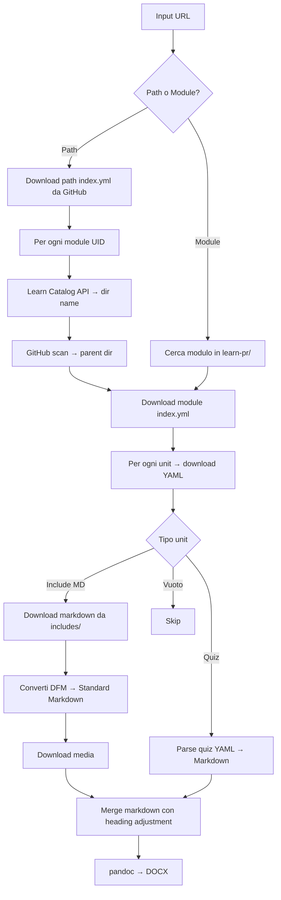

# MsftLearnToDocx

Console .NET 8 che converte un Microsoft Learn training path o un singolo modulo in un documento Markdown unificato e in un file Word (DOCX) tramite **pandoc**.

## Prerequisiti

- [.NET 8 SDK](https://dotnet.microsoft.com/download/dotnet/8.0)
- [pandoc](https://pandoc.org/installing.html) nel PATH di sistema
- (Opzionale) `GITHUB_TOKEN` come variabile d'ambiente per rate limit più alti sull'API GitHub

## Utilizzo

```bash
# Learning path completo
dotnet run -- "https://learn.microsoft.com/en-us/training/paths/copilot/"

# Singolo modulo
dotnet run -- "https://learn.microsoft.com/en-us/training/modules/introduction-to-github-copilot/"

# Con template DOCX personalizzato
dotnet run -- "https://learn.microsoft.com/en-us/training/paths/copilot/" --template template.docx

# Help
dotnet run -- --help
```

## Output

I file generati vengono salvati in `output/{slug}_{timestamp}/`:

```
output/copilot_20260314-120000/
├── media/           # Immagini scaricate (prefissate con M{n}_ per modulo)
├── copilot.md       # Markdown unificato
└── copilot.docx     # Documento Word (con Table of Contents)
```

### Template DOCX

Il template pandoc viene cercato automaticamente in `Templates/template.docx` nella directory di lavoro. Per usare un template diverso:

```bash
dotnet run -- "<url>" --template path/to/custom-template.docx
```

## Architettura

### Flusso



### Risoluzione path moduli

La corrispondenza tra UID del modulo e percorso GitHub non è deterministica. Eccezioni note:

| UID | Directory GitHub | Note |
|-----|-----------------|------|
| `learn.github.copilot-spaces` | `introduction-copilot-spaces` | slug ≠ uid |
| `learn.github-copilot-with-javascript` | `introduction-copilot-javascript` | slug ≠ uid, nessun provider |
| `learn.wwl.*` | `learn-pr/wwl-azure/` | wwl ≠ wwl-azure |
| `learn.advanced-github-copilot` | `learn-pr/github/` | nessun provider nel uid |

**Strategia**: Learn Catalog API (`url` field) → directory name reale → GitHub Contents API scan per la parent directory.

### Conversione DFM → Markdown standard

Sintassi Docs-Flavored Markdown gestite:

- `:::image type="content" source="..." alt-text="...":::` → ``
- `> [!NOTE]`, `> [!TIP]`, `> [!WARNING]`, `> [!IMPORTANT]`, `> [!CAUTION]` → blockquote con label bold
- `> [!div class="nextstepaction"]`, `> [!div class="checklist"]` → rimossi
- `:::zone target="...":::` / `:::zone-end:::` → rimossi
- `:::row:::`, `:::column:::` → rimossi
- `[!VIDEO url]` → link
- `:::code language="..." source="...":::` → download sorgente da GitHub, inline con supporto `range`
- `[!INCLUDE[](path)]` residui → rimossi

### Gerarchia heading nel documento unificato

- **Path mode**: H1=Titolo path, H2=Titolo modulo, H3=Titolo unit, H4+=Contenuto
- **Module mode**: H1=Titolo modulo, H2=Titolo unit, H3+=Contenuto

## Struttura progetto

```
├── MsftLearnToDocx.csproj     # Progetto .NET 8
├── Program.cs                  # Entry point e orchestrazione
├── Models/
│   └── LearnModels.cs          # Modelli YAML, Catalog API, contenuto scaricato
└── Services/
    ├── GitHubRawClient.cs      # Download raw content + Contents API
    ├── LearnCatalogClient.cs   # Microsoft Learn Catalog API
    ├── ModuleResolver.cs       # UID → GitHub path resolution
    ├── ContentDownloader.cs    # Orchestrazione download completo
    ├── DfmConverter.cs         # DFM → standard Markdown
    ├── MarkdownMerger.cs       # Merge + heading level adjustment
    ├── PandocRunner.cs         # Conversione pandoc → DOCX (con TOC)
    └── RetryHandler.cs         # Retry HTTP con exponential backoff
```

## Dipendenze

- [YamlDotNet](https://github.com/aaubry/YamlDotNet) – parsing YAML
- [pandoc](https://pandoc.org/) – conversione Markdown → DOCX (esterno)

## Resilienza HTTP

`RetryHandler` (DelegatingHandler) gestisce automaticamente:
- HTTP 429 (Too Many Requests) con rispetto header `Retry-After`
- HTTP 5xx / timeout con exponential backoff (2s, 4s, 8s)
- Errori di rete con 3 retry automatici
