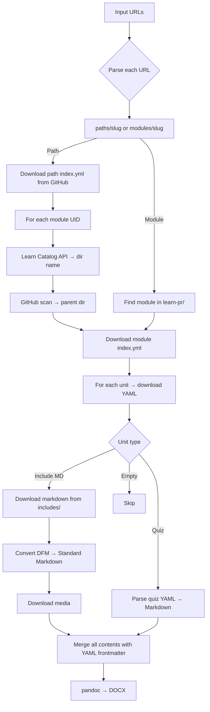

# MsftLearnToDocx

.NET 8 console app that converts Microsoft Learn training paths and modules into a unified Markdown document and a Word (DOCX) file via **pandoc**.

## Prerequisites

- [.NET 8 SDK](https://dotnet.microsoft.com/download/dotnet/8.0)
- [pandoc](https://pandoc.org/installing.html) in system PATH
- (Optional) `GITHUB_TOKEN` environment variable for higher GitHub API rate limits

## Usage

```bash
# Single learning path
dotnet run -- "https://learn.microsoft.com/en-us/training/paths/copilot/"

# Single module
dotnet run -- "https://learn.microsoft.com/en-us/training/modules/introduction-to-github-copilot/"

# Multiple URLs merged into one document
dotnet run -- "https://learn.microsoft.com/.../paths/copilot/" "https://learn.microsoft.com/.../modules/mod/"

# With custom title and DOCX template
dotnet run -- "https://learn.microsoft.com/.../paths/copilot/" --title "GitHub Copilot Guide" --template custom.docx

# Help
dotnet run -- --help
```

### Docker

Build and run without installing .NET or pandoc locally:

```bash
# Build the image
docker build -t msft-learn-to-docx .

# Run (output mounted to current directory)
docker run --rm -v "$(pwd)/output:/output" \
  -e GITHUB_TOKEN="$GITHUB_TOKEN" \
  msft-learn-to-docx \
  "https://learn.microsoft.com/en-us/training/paths/copilot/"

# Multiple URLs with custom title
docker run --rm -v "$(pwd)/output:/output" \
  msft-learn-to-docx \
  "https://learn.microsoft.com/.../paths/copilot/" \
  "https://learn.microsoft.com/.../modules/mod/" \
  --title "My Training Guide"
```

Pre-built image (if published):

```bash
docker pull <your-dockerhub-user>/msft-learn-to-docx
docker run --rm -v "$(pwd)/output:/output" <your-dockerhub-user>/msft-learn-to-docx "<url>"
```

## Output

Generated files are saved under `output/{slug}_{timestamp}/`:

```
output/copilot_20260314-120000/
├── media/           # Downloaded images (prefixed with M{n}_ per module)
├── copilot.md       # Unified Markdown (with YAML frontmatter cover page)
└── copilot.docx     # Word document (with Table of Contents)
```

### Heading Hierarchy

Every unit is rendered as a top-level section (H1). Content headings within each unit start at H2. The YAML frontmatter block (`title`, `date`) is used by pandoc to generate a Word cover page.

### DOCX Template

The pandoc template is auto-detected from `Templates/template.docx` in the working directory. To use a different template:

```bash
dotnet run -- "<url>" --template path/to/custom-template.docx
```

## Architecture

### Data Flow



### Module Path Resolution

The mapping between module UID and GitHub path is non-deterministic. Known exceptions:

| UID | GitHub Directory | Notes |
|-----|-----------------|-------|
| `learn.github.copilot-spaces` | `introduction-copilot-spaces` | slug ≠ uid |
| `learn.github-copilot-with-javascript` | `introduction-copilot-javascript` | slug ≠ uid, no provider |
| `learn.wwl.*` | `learn-pr/wwl-azure/` | wwl ≠ wwl-azure |
| `learn.advanced-github-copilot` | `learn-pr/github/` | no provider in uid |

**Strategy**: Learn Catalog API (`url` field) → real directory name → GitHub Contents API scan for parent directory.

### DFM → Standard Markdown Conversion

Handled Docs-Flavored Markdown syntax:

- `:::image type="content" source="..." alt-text="...":::` → ``
- `> [!NOTE]`, `> [!TIP]`, `> [!WARNING]`, `> [!IMPORTANT]`, `> [!CAUTION]` → blockquote with bold label
- `> [!div class="nextstepaction"]`, `> [!div class="checklist"]` → removed
- `:::zone target="...":::` / `:::zone-end:::` → removed
- `:::row:::`, `:::column:::` → removed
- `[!VIDEO url]` → link
- `:::code language="..." source="...":::` → downloads source from GitHub, inlines with `range` support
- `[!INCLUDE[](path)]` residuals → removed

## Project Structure

```
├── MsftLearnToDocx.csproj     # .NET 8 project
├── Program.cs                  # Entry point and orchestration
├── Dockerfile                  # Multi-stage Docker build (SDK → runtime + pandoc)
├── .dockerignore               # Docker build exclusions
├── Models/
│   └── LearnModels.cs          # YAML, Catalog API, and downloaded content models
├── Services/
│   ├── GitHubRawClient.cs      # Raw content download + Contents API
│   ├── LearnCatalogClient.cs   # Microsoft Learn Catalog API
│   ├── ModuleResolver.cs       # UID → GitHub path resolution
│   ├── ContentDownloader.cs    # Full download orchestration
│   ├── DfmConverter.cs         # DFM → standard Markdown
│   ├── MarkdownMerger.cs       # Merge + YAML frontmatter + heading normalization
│   ├── PandocRunner.cs         # pandoc → DOCX conversion (with TOC)
│   └── RetryHandler.cs         # HTTP retry with exponential backoff
└── Templates/
    └── template.docx           # Default pandoc reference-doc template
```

## Dependencies

- [YamlDotNet](https://github.com/aaubry/YamlDotNet) – YAML parsing
- [pandoc](https://pandoc.org/) – Markdown → DOCX conversion (external)

## HTTP Resilience

`RetryHandler` (DelegatingHandler) automatically handles:
- HTTP 429 (Too Many Requests) respecting the `Retry-After` header
- HTTP 5xx / timeouts with exponential backoff (2s, 4s, 8s)
- Network errors with 3 automatic retries
